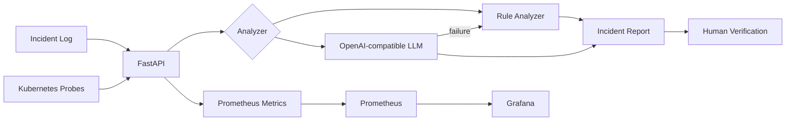

# AI Incident Copilot

> **장애 로그를 AI와 함께 분석해 원인 후보 → 조치 순서 → 검증 절차로 바꾸는 AI Infrastructure 운영 도구**

운영 장애에서 중요한 것은 로그를 요약하는 것보다 **어디부터 확인해야 하는지** 빠르게 구조화하는 일이라고 보았습니다. 이 프로젝트는 FastAPI 기반 incident triage API에 재현 가능한 rule analyzer와 선택적 OpenAI-compatible LLM adapter를 결합합니다.

## 핵심 원칙

- **SHOW**: API, 테스트, Docker, Kubernetes, metrics, dashboard 구성을 공개합니다.
- **PROVE**: 실행한 것과 아직 실행하지 않은 것을 `docs/VALIDATION.md`에서 분리합니다.
- **Human in the loop**: AI의 원인/조치 제안을 자동 실행하지 않고 로그·메트릭·이벤트와 대조합니다.
- **Reproducible**: API key 없이도 deterministic mode로 핵심 흐름을 재현할 수 있습니다.

## Architecture



자세한 설명: [docs/ARCHITECTURE.md](docs/ARCHITECTURE.md)

## Quick start

```bash
cd incident-copilot
python -m venv .venv
# Windows: .venv\Scripts\activate
# Linux/macOS: source .venv/bin/activate
pip install -r requirements.txt
pytest -q
uvicorn app.main:app --reload
```

```bash
curl -X POST http://127.0.0.1:8000/analyze \
 -H "Content-Type: application/json" \
 -d '{"service":"llm-serving","logs":"Pod terminated: OOMKilled. CUDA out of memory"}'
```

## Optional LLM mode

vLLM 등 OpenAI-compatible endpoint가 준비된 경우에만 사용합니다.

```bash
export ANALYZER_MODE=openai-compatible
export LLM_BASE_URL=http://localhost:8001/v1
export LLM_MODEL=<your-model>
export LLM_API_KEY=EMPTY
uvicorn app.main:app --port 8000
```

Endpoint 호출 실패 시 deterministic analyzer로 fallback합니다.

## Docker + Observability

```bash
docker compose up --build
```

- API: localhost:8000
- Prometheus: localhost:9090
- Grafana: localhost:3000
- Metrics: localhost:8000/metrics

Grafana datasource와 dashboard는 자동 provisioning하도록 저장소에 포함했습니다.

## Kubernetes

```bash
kubectl apply -f k8s/deployment.yaml
kubectl port-forward svc/incident-copilot 8000:80
```

startup/readiness/liveness probe와 CPU/memory requests/limits를 정의합니다. 실제 클러스터 실행 증거가 없는 상태에서는 배포 완료라고 주장하지 않습니다.

## Failure scenarios

| Scenario | Sample | Expected |
|---|---|---|
| GPU/Pod OOM | `samples/oom.log` | CRITICAL |
| Backend down | `samples/backend-down.log` | HIGH |
| Overload | `samples/overload.log` | HIGH |

## Load test

```bash
locust -f loadtest/locustfile.py --host http://127.0.0.1:8000
```

수치는 실제 실행 후에만 기록합니다.

## Evidence map

| 주장 | 코드/증거 |
|---|---|
| API와 구조화 결과 | `app/main.py` |
| 재현 가능한 분석 | `app/analyzers.py` |
| LLM 확장 + fallback | `OpenAICompatibleAnalyzer` |
| 회귀 테스트 | `tests/test_api.py` + GitHub Actions |
| 컨테이너/관측성 | `Dockerfile`, `docker-compose.yml`, `monitoring/` |
| K8s 운영 기본기 | `k8s/deployment.yaml` |
| 장애 실험 입력 | `samples/` |
| AI 활용과 인간 판단 | `docs/AI_PROCESS.md` |
| 검증 범위 | `docs/VALIDATION.md` |

## AI를 어떻게 사용했나

AI를 코드 생성기로만 사용하지 않고 설계 검토, 실패 시나리오 생성, 테스트 초안, 누락 점검에 사용했습니다. 실제로 초기 CI workflow 위치가 잘못되어 실행되지 않는 문제를 발견했고, 저장소 루트 `.github/workflows/`로 수정했습니다. **AI 결과도 실행 여부를 확인하고 틀리면 수정한다**는 원칙을 프로젝트 문서에 남겼습니다.

## 현재 검증 상태

실제 GPU/vLLM end-to-end, Kubernetes cluster, Grafana 화면, 부하테스트 수치는 아직 실제 실행 증거가 없으므로 완료로 표시하지 않습니다. 자세한 상태는 [docs/VALIDATION.md](docs/VALIDATION.md)를 기준으로 합니다.

## Portfolio docs

- [AI-assisted problem solving](docs/AI_PROCESS.md)
- [Validation record](docs/VALIDATION.md)
- [Architecture](docs/ARCHITECTURE.md)
- [Submission copy](docs/SUBMISSION.md)
