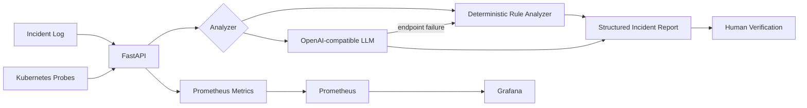

# AI Incident Copilot

> **장애 로그를 AI와 함께 분석해 원인 후보 -> 조치 순서 -> 검증 절차로 바꾸는 AI Infrastructure 운영 도구**

운영 장애에서 중요한 것은 로그를 요약하는 것보다 **어디부터 확인해야 하는지 빠르게 구조화하고, 제안을 실제 증거와 대조하는 것**이라고 보았습니다. FastAPI 기반 incident triage API에 재현 가능한 deterministic analyzer와 선택적 OpenAI-compatible LLM adapter를 결합했습니다.

## What is proven

최종 기준 GitHub Actions **run #53**에서 아래 검증이 한 번의 pipeline으로 모두 성공했습니다.

- pytest regression tests
- Docker Compose configuration validation
- Kubernetes manifest Helm lint
- Docker image build + container boot
- `GET /healthz`, `POST /analyze`, Prometheus metrics endpoint
- Prometheus + Grafana runtime startup and scrape verification
- Locust 10-user / 10-second load smoke test

CI #53 부하 smoke test 결과: **300 requests, 0 failures, 약 30.79 req/s, median 2 ms, p95 3 ms**. 이 수치는 GitHub-hosted runner의 deterministic mode 결과이며 GPU/LLM 성능 수치가 아닙니다.

## Architecture



## AI Decision Loop

이 프로젝트에서 AI는 장식이 아니라 **비정형 장애 로그 → 운영 판단 후보** 변환을 담당합니다.

```text
Raw logs
  ↓
OpenAI-compatible analyzer
  ↓
severity + signals + likely causes + recommended actions
  ↓
verification checklist
  ↓
Human checks logs / metrics / Kubernetes events
  ↓
action or correction
```

LLM success path는 OpenAI-compatible JSON 응답을 모사해 parsing, structured output, analyzer mode, human-verification contract를 자동 테스트합니다. endpoint failure path 역시 강제로 재현해 deterministic analyzer fallback을 검증합니다. **실제 모델 추론과 protocol-level adapter 검증은 구분해 표기합니다.**

## Reproduce

```bash
cd incident-copilot
python -m venv .venv
# Windows: .venv\Scripts\activate
# Linux/macOS: source .venv/bin/activate
pip install -r requirements.txt
python -m pytest -q
uvicorn app.main:app --reload
```

```bash
curl -X POST http://127.0.0.1:8000/analyze \
 -H "Content-Type: application/json" \
 -d '{"service":"llm-serving","logs":"Pod terminated: OOMKilled. CUDA out of memory"}'
```

전체 stack:

```bash
docker compose up --build
```

- API: localhost:8000
- Prometheus: localhost:9090
- Grafana: localhost:3000
- Metrics: localhost:8000/metrics/

## Optional LLM mode

```bash
export ANALYZER_MODE=openai-compatible
export LLM_BASE_URL=http://localhost:8001/v1
export LLM_MODEL=<your-model>
export LLM_API_KEY=EMPTY
uvicorn app.main:app --port 8000
```

실제 OpenAI-compatible/vLLM endpoint와 NVIDIA GPU E2E는 별도 GPU 환경 증거가 생기기 전까지 완료라고 주장하지 않습니다.

## Failure scenarios

| Scenario | Expected | Evidence |
|---|---|---|
| GPU/Pod OOM | CRITICAL | sample + regression test |
| Backend connection refused | HIGH | sample + regression test + container smoke |
| Timeout/overload | HIGH | sample + regression test |
| LLM endpoint unavailable | deterministic fallback | mocked endpoint-failure regression test |

## Failure -> Fix -> Re-test

실행하면서 발견된 실패도 결과물로 남겼습니다.

1. Python import 실패 -> workflow working directory/PYTHONPATH 수정 -> CI 성공
2. Docker 8000 port collision -> smoke container lifecycle 수정 -> 재검증
3. Prometheus 첫 scrape 전 조회 race -> polling 후 `up=1` 검증 -> 재검증
4. CI #53 -> 8-case severity evaluation 8/8 + test, Docker, K8s lint, monitoring, load smoke 전 단계 success

자세한 기록: [docs/EVIDENCE.md](docs/EVIDENCE.md)

## Evidence map

| Claim | Evidence |
|---|---|
| Structured incident API | `app/main.py` |
| deterministic + LLM adapter/fallback | `app/analyzers.py` |
| regression tests | `tests/test_api.py` |
| Docker runtime | `Dockerfile`, `docker-compose.yml`, CI #53 |
| Kubernetes configuration | `k8s/deployment.yaml`, Helm lint in CI #53 |
| Prometheus/Grafana runtime | `monitoring/`, CI #53 |
| load smoke | `loadtest/locustfile.py`, CI #53 |
| AI/human verification process | `docs/AI_PROCESS.md` |
| evidence ledger | `docs/EVIDENCE.md` |

## Scope boundary

검증된 것과 검증되지 않은 것을 분리합니다. 현재 **실제 GPU/vLLM E2E, NVIDIA GPU 할당/모델 로딩, 실제 Kubernetes cluster의 probe 캡처**는 증거가 없어 완료로 표시하지 않습니다. 반면 Docker runtime, monitoring runtime, API tests, manifest validation, load smoke는 GitHub Actions에서 재현 검증했습니다.
